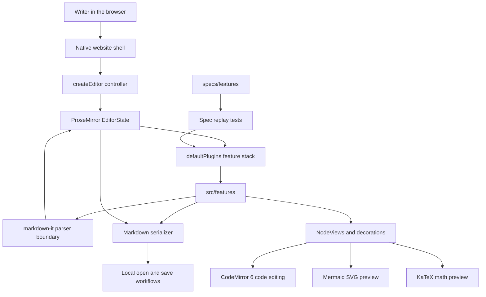

[中文](README_zh-CN.md)

<p align="center">
  
</p>

# Typora-Web

> A native, lightweight, high-performance Typora-style Markdown editor for the web.

Typora-Web makes Markdown feel like a finished document while it is still being
edited. Source markers fade when they are not needed, rich blocks render in
place, and the underlying Markdown remains round-trippable.

The project is built with TypeScript, ProseMirror, markdown-it, CodeMirror 6,
KaTeX, Mermaid, DOMPurify, and native DOM APIs. It intentionally does not use
Vue, React, Svelte, Angular, or any other frontend framework.

## Attribution

This project is based on the original [Yuyz0112/typora-web][original-typora-web]
project by Yanzhen Yu. This repository continues that MIT-licensed foundation
with additional syntax support, editing behavior, tests, documentation, and
release automation. Respect and thanks go to the original author for the
initial design and implementation.

## Links

- [Live demo][demo]
- [Spec catalog][demo-specs]
- [Contribution guide](CONTRIBUTING.md)
- [Commit convention](docs/git-commit-convention.md)
- [Release process](docs/release-process.md)
- [Syntax survey](docs/typora-syntax-survey.md)

## Release Status

Typora-Web uses standard Semantic Versioning and stable GitHub Releases such as
`v0.8.0`. Release automation is driven by Conventional Commits through Release
Please. A release pull request is opened only when merged changes contain a
release-worthy `feat`, `fix`, `perf`, or breaking-change commit.

## Highlights

| Area | Support |
|---|---|
| Editing model | WYSIWYG-style Markdown editing with source-preserving ProseMirror documents |
| Markdown baseline | CommonMark 0.31.2 through markdown-it CommonMark mode |
| Typora extensions | Highlight, subscript, superscript, `[toc]`, emoji shortcodes, math, and Mermaid |
| Code blocks | Editable fenced code blocks with CodeMirror 6 language support and lazy-loaded highlighting |
| HTML blocks | Sanitized live preview with editable source reveal |
| Math | Inline and block math rendered with KaTeX |
| Diagrams | Mermaid fences render lazy SVG previews and keep errors contained |
| Local files | Open, edit, save, and Save As for local `.md` files where browser APIs allow it |
| Focus tools | Focus mode, typewriter mode, source mode, and common editing shortcuts |
| Appearance | Built-in light and dark appearances, no runtime external CSS theme import |
| Website chrome | English and Chinese UI switching; document content is never translated |

## Technical Choices

Typora-Web is built for a native, lightweight, high-performance editing surface.
It avoids Vue, React, Svelte, Angular, and similar UI frameworks. The runtime is
plain TypeScript, DOM APIs, and ProseMirror.

| Technology | Role | Why it is used |
|---|---|---|
| TypeScript | Main implementation language | Static contracts for schema, parser, serializer, and controller APIs |
| Native DOM APIs | Website chrome and NodeView UI | Keeps runtime dependencies small and avoids framework scheduling overhead |
| ProseMirror | Editor state, transactions, plugins, NodeViews | Gives structured editing primitives while preserving Markdown source mapping |
| markdown-it CommonMark mode | Markdown parser boundary | Aligns the baseline with CommonMark 0.31.2 and supports explicit extensions |
| Custom serializer | Markdown output | Preserves supported source forms for round-trippable saves |
| CodeMirror 6 | Source mode and fenced code editing | Matches Typora's CodeMirror-based code editing path with lazy language loading |
| `@codemirror/language-data` | Language candidates | Uses official CodeMirror language descriptions instead of handwritten guesses |
| KaTeX | Inline and block math | Fast local math rendering |
| Mermaid | Diagram fences | Progressive enhancement for valid `mermaid` fenced code |
| DOMPurify | HTML block sanitization | Allows HTML block previews while removing unsafe scripts and event attributes |
| Vite Plus / TypeScript build | Development, tests, builds | Lightweight local dev server, library build, and test runner |
| pnpm | Package management | Reproducible installs and the repository-standard frontend package manager |

Markdown is an IO boundary. The runtime authority is ProseMirror `EditorState`.
Inline Markdown uses the Method-B model: delimiter characters stay in text nodes,
and `normalize.ts` derives marks from those characters. Feature code should edit
source text and let normalization rebuild marks.

## Try It

Open the [live demo][demo] and edit the document directly. If you are reading
this file on GitHub, the rich editing behavior is not visible because GitHub
renders Markdown statically.

Useful shortcuts:

| Shortcut | Behavior |
|---|---|
| `Mod-/` | Toggle rendered/source mode |
| `F8` | Toggle focus mode |
| `F9` | Toggle typewriter mode |
| `Mod-b` / `Mod-i` | Toggle bold or italic |
| `Mod-k` | Create or edit a link |
| `Shift-Enter` | Insert a hard break |
| `Mod-0`..`Mod-6` | Paragraph or heading levels |
| `Mod-Shift-7` / `Mod-Shift-8` | Ordered or bullet list |
| `Mod-Shift-q` | Blockquote |
| `Mod-Shift-k` | Fenced code block |
| `Mod-Shift-m` | Math block |

`Mod` means `Cmd` on macOS and `Ctrl` elsewhere.

## Install

```sh
pnpm add typora-web
```

## Usage

```ts
import { createEditor } from "typora-web";
import "typora-web/widgets.css";
import "typora-web/theme-typora.css";
import "katex/dist/katex.min.css";

const editor = createEditor(document.querySelector("#app")!, {
  initialContent: "# Hello Typora-Web",
  onChange: (markdown) => {
    console.log(markdown);
  },
});
```

The required editor chrome lives in `typora-web/widgets.css`. Import one content
theme after it. The default demo imports `typora-web/theme-typora.css`.

Built-in light and dark appearances are controlled with `data-appearance` on the
document root:

```ts
document.documentElement.dataset.appearance = "dark";
document.documentElement.style.colorScheme = "dark";
```

The demo website provides this as a top-right toggle. External Typora `.css`
theme import was removed to keep the editor style surface predictable.

## Controller API

`createEditor(host, options)` returns a small controller:

| Method / field | Description |
|---|---|
| `editor.getMarkdown()` | Return the current Markdown |
| `editor.setMarkdown(markdown)` | Replace the current document |
| `editor.toggleSource()` | Toggle rendered/source mode |
| `editor.isSourceMode()` | Return whether source mode is active |
| `editor.toggleFocusMode()` | Toggle focus mode |
| `editor.setFocusMode(enabled)` | Set focus mode explicitly |
| `editor.isFocusMode()` | Return whether focus mode is active |
| `editor.toggleTypewriterMode()` | Toggle typewriter mode |
| `editor.setTypewriterMode(enabled)` | Set typewriter mode explicitly |
| `editor.isTypewriterMode()` | Return whether typewriter mode is active |
| `editor.openMarkdownFile()` | Open a local `.md` file when available |
| `editor.saveMarkdownFile()` | Save to the current file handle or fall back to Save As |
| `editor.saveMarkdownFileAs()` | Save through File System Access API or download fallback |
| `editor.getCurrentFileName()` | Return the current local file name, when known |
| `editor.focus()` | Focus the active editing surface |
| `editor.destroy()` | Destroy the editor and remove its DOM |
| `editor.view` | Advanced escape hatch to the ProseMirror `EditorView` |

Options:

| Option | Description |
|---|---|
| `initialContent` | Initial Markdown content |
| `onChange(markdown)` | Called after document transactions |
| `onFocus()` | Called when the active editing surface receives focus |
| `onBlur()` | Called when the active editing surface loses focus |

## Markdown Support

The parser is constrained by [CommonMark 0.31.2][cm]. Typora-specific behavior is
implemented as explicit, tested extensions.

Stable areas:

- Paragraphs, hard breaks, soft breaks, ATX headings, setext headings,
  blockquotes, thematic breaks, lists, task lists, tables, fenced code blocks,
  HTML blocks, math blocks, Mermaid fences, YAML front matter, and `[toc]`.
- Emphasis, strong, inline code, strikethrough, highlight, subscript,
  superscript, links, images, autolinks, emoji shortcodes, and inline math.
- Focus mode, typewriter mode, source mode, common editing shortcuts, local
  Markdown file workflows, bilingual website chrome, and built-in light/dark
  appearance.

Partial or intentionally pending areas:

- Indented code blocks parse, but serialize as fenced code.
- Reference definitions can be entered live, but markdown-it consumes
  definitions during parse.
- Some complex emphasis rule-of-three and escaped-link edge cases remain.
- Block HTML renders through a DOMPurify-sanitized preview and reveals source on
  click; inline HTML is still preserved as source text.
- Mermaid is the only diagram engine currently implemented.
- Runtime import of external Typora CSS themes is intentionally not supported.

For the full compatibility matrix, see [docs/typora-syntax-survey.md](docs/typora-syntax-survey.md).

## Architecture



The codebase is organized around small feature modules:

| Path | Purpose |
|---|---|
| `src/editor-api.ts` | Public `createEditor()` controller and DOM mounting |
| `src/editor.ts` | ProseMirror plugin stack |
| `src/schema.ts` | Core schema plus feature-contributed nodes and marks |
| `src/parser.ts` | Markdown parsing through markdown-it and feature token handlers |
| `src/serializer.ts` | Markdown serialization |
| `src/features/` | One module per Markdown or Typora feature |
| `specs/features/` | Executable behavior specs |
| `tests/` | Unit tests, parser tests, round-trip tests, and spec replay tests |
| `website/` | Native demo site and spec catalog |

Feature work should preserve Markdown source form. If a visual preview is needed
while text remains editable, prefer ProseMirror decorations or NodeViews that
keep the source text in the document.

## Development

Use pnpm only:

```sh
pnpm install
pnpm dev
pnpm test
pnpm build
pnpm build:lib
```

The test suite is spec-driven. Each behavior spec describes:

- the seed Markdown,
- the event stream,
- and the expected rendered output at each checkpoint.

The live spec catalog at [the demo specs page][demo-specs] exposes the same
fixtures in a browser.

## Contributing

Bug reports and feature requests are accepted as specs whenever possible. A good
report includes:

- the seed Markdown,
- the exact event sequence,
- the rendered output Typora produces,
- and the rendered output Typora-Web currently produces.

Before opening a pull request, read [CONTRIBUTING.md](CONTRIBUTING.md). Commits
must follow [Conventional Commits 1.0.0][conventional-commits] and should be
split by logical change category.

## License

[MIT](LICENSE)

[cm]: https://spec.commonmark.org/0.31.2/ "CommonMark 0.31.2"
[conventional-commits]: https://www.conventionalcommits.org/en/v1.0.0/ "Conventional Commits 1.0.0"
[demo]: https://albert-pzy.github.io/typora-web/ "Typora-Web live demo"
[demo-specs]: https://albert-pzy.github.io/typora-web/#/specs "Typora-Web spec catalog"
[original-typora-web]: https://github.com/Yuyz0112/typora-web "Original typora-web repository"
